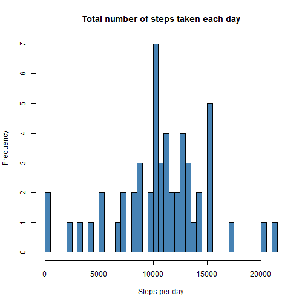
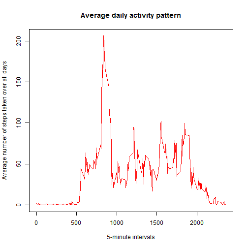
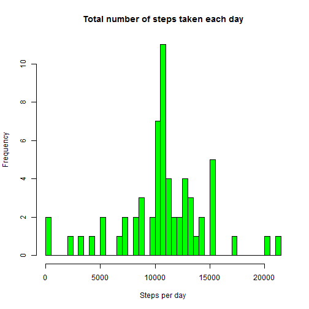
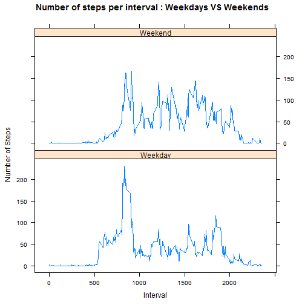

# Reproducible Research: Peer Assessment 1

Hello World from Thien! ;-)  

This is my copy of the first project for peer assessment.  
It is part of the **Reproducible Research** Course from the 
***Coursera's Data Science Specialization***.  

## Loading and preprocessing the data

*NB: The .zip file containing the data is assumed to be in the current working directory.*

### First, we are going to load the data provided for this project:


```r
unzip(zipfile = "./activity.zip")  # unzip the data into the proper csv file
data <- read.csv(file = "./activity.csv")  # load the csv file
```


Then, we take a quick look at the data loaded:


```r
sapply(data[1, ], class)  # getting the class of each feature
```

```
##     steps      date  interval 
## "integer"  "factor" "integer"
```


### Thus, we preprocess it a little bit with respect to the dates and the steps number feature to be numeric instead of integer:


```r
data$date <- as.Date(data$date)  # converting to proper date format
data$steps <- as.numeric(data$steps)  # converting to numeric format
```


and quickly show a summary of the data:


```r
summary(data)
```

```
##      steps            date               interval   
##  Min.   :  0.0   Min.   :2012-10-01   Min.   :   0  
##  1st Qu.:  0.0   1st Qu.:2012-10-16   1st Qu.: 589  
##  Median :  0.0   Median :2012-10-31   Median :1178  
##  Mean   : 37.4   Mean   :2012-10-31   Mean   :1178  
##  3rd Qu.: 12.0   3rd Qu.:2012-11-15   3rd Qu.:1766  
##  Max.   :806.0   Max.   :2012-11-30   Max.   :2355  
##  NA's   :2304
```


## What is mean total number of steps taken per day?

### First, we make a histogram of the total number of steps taken per day:


```r
# computing the total number of steps taken each day
daily_steps <- aggregate(steps ~ date, data = data, FUN = sum)
```


```r
# plotting the histogram of the total number of steps taken each day
hist(daily_steps$steps, breaks = nrow(daily_steps), main = "Total number of steps taken each day", 
    xlab = "Steps per day", col = "Steelblue")
```

 


### Then, we compute the mean and median:


```r
mean.daily_steps <- mean(daily_steps$steps)  # computing the mean
median.daily_steps <- median(daily_steps$steps)  # computing the median
```


#### The mean of the total number of daily steps taken is: ***10766***

#### The median of the total number of daily steps taken is: ***10765***

## What is the average daily activity pattern?

### First, we make a time series of the 5-minute interval and the average number of taken steps, averaged across all days:


```r
interval_mean <- aggregate(steps ~ interval, data = data, FUN = mean)  # averaging by 5-minutes interval
plot(interval_mean, type = "l", main = "Average daily activity pattern", xlab = "5-minute intervals", 
    ylab = "Average number of steps taken over all days", col = "Red")
```

 


### The previous plot shows the max which can also be computed as follows:


```r
max_interval <- interval_mean[which.max(interval_mean$steps), "interval"]
```


### Averaged across all days, the 5-minute interval which contains the maximum number of steps is the ***835th*** interval.

## Imputing missing values

### The total numbers of NA's have been already shown within the summary of the data. 

We already saw that only the steps feature has NA's. 
Let's check it once more on each feature:


```r
total_NAs <- sum(is.na(data))
steps_NAs <- sum(is.na(data$steps))
date_NAs <- sum(is.na(data$date))
interval_NAs <- sum(is.na(data$interval))
```


```r
print(total_NAs)
```

```
## [1] 2304
```

```r
print(steps_NAs)
```

```
## [1] 2304
```

```r
print(date_NAs)
```

```
## [1] 0
```

```r
print(interval_NAs)
```

```
## [1] 0
```


We see that the total number of NA's is ***2304***:

1. **2304** NA's within the steps feature
2. **0** NA's within the dates feature
3. **0** NA's within the interval feature

### *Then, the adopted strategy will be to replace the NA's within the steps feature by the mean of the 5-minute interval averaged across all days.*

### Thus, we create a new dataset from the orginal one:

* In order to do so, we jus create a vector containing the steps feature repalcing NA's by the previously evoked mean:


```r
# create a vector of steps with NAs replaced by the mean
new_steps <- numeric()
for (i in 1:nrow(data)) {
    obs <- data[i, ]
    if (is.na(obs$steps)) {
        steps <- subset(interval_mean, interval == obs$interval)$steps
    } else {
        steps <- obs$steps
    }
    new_steps <- c(new_steps, steps)
}
```


* Then, we put this newly created vector in the proper part of the original data:


```r
new_data <- data
new_data$steps <- new_steps
```


We can check it is properly done through a quick summary of the newly created dataset:


```r
summary(new_data)
```

```
##      steps            date               interval   
##  Min.   :  0.0   Min.   :2012-10-01   Min.   :   0  
##  1st Qu.:  0.0   1st Qu.:2012-10-16   1st Qu.: 589  
##  Median :  0.0   Median :2012-10-31   Median :1178  
##  Mean   : 37.4   Mean   :2012-10-31   Mean   :1178  
##  3rd Qu.: 27.0   3rd Qu.:2012-11-15   3rd Qu.:1766  
##  Max.   :806.0   Max.   :2012-11-30   Max.   :2355
```


We see that the only difference is that there is no more NA.

* We make another histogram of the new dataset pretty much the same way as we did with the original dataset:


```r
# computing the total number of steps taken each day
new_daily_steps <- aggregate(steps ~ date, data = new_data, FUN = sum)
```


```r
# plotting the histogram of the total number of steps taken each day
hist(new_daily_steps$steps, breaks = nrow(new_daily_steps), main = "Total number of steps taken each day", 
    xlab = "Steps per day", col = "Green")
```

 


* We now compute the new mean and median of daily steps from this new dataset:


```r
new_mean_daily_steps <- mean(new_daily_steps$steps)
new_median_daily_steps <- median(new_daily_steps$steps)
```


The results are as follows:


```r
print(new_mean_daily_steps)
```

```
## [1] 10766
```

```r
print(new_median_daily_steps)
```

```
## [1] 10766
```


#### We see that the new median seems to have reached the mean value. Let's check that :


```r
new_mean_daily_steps == new_median_daily_steps
```

```
## [1] TRUE
```


#### The way we filled the steps's NA's with the mean value has the impact of taking the median value closer to the mean value.

## Are there differences in activity patterns between weekdays and weekends?

* First we create a new feature in the new dataset in order to input the *weekday* or *weekend*:


```r
new_data$day <- weekdays(as.Date(new_data$date))
new_data$day[new_data$day == "lundi"] <- "Weekday"
new_data$day[new_data$day == "mardi"] <- "Weekday"
new_data$day[new_data$day == "mercredi"] <- "Weekday"
new_data$day[new_data$day == "jeudi"] <- "Weekday"
new_data$day[new_data$day == "vendredi"] <- "Weekday"
new_data$day[new_data$day == "samedi"] <- "Weekend"
new_data$day[new_data$day == "dimanche"] <- "Weekend"
```


***NB: The previous days are wrt French names of the days of the week... You need to change them to their English (or whatever) equivalents if needed! ;-)***

Let's check by presenting a quick summary:


```r
summary(new_data)
```

```
##      steps            date               interval        day           
##  Min.   :  0.0   Min.   :2012-10-01   Min.   :   0   Length:17568      
##  1st Qu.:  0.0   1st Qu.:2012-10-16   1st Qu.: 589   Class :character  
##  Median :  0.0   Median :2012-10-31   Median :1178   Mode  :character  
##  Mean   : 37.4   Mean   :2012-10-31   Mean   :1178                     
##  3rd Qu.: 27.0   3rd Qu.:2012-11-15   3rd Qu.:1766                     
##  Max.   :806.0   Max.   :2012-11-30   Max.   :2355
```


* Now we create a panel plot containing the time series plot of the mean number of steps taken averaged across all weekday or weekend days:

First,we compute the mean number of steps per type of day:
   

```r
require(plyr)  # note that we need the plyr library
```

```
## Loading required package: plyr
```

```r
mean_steps <- ddply(new_data, .(interval, day), summarize, steps = mean(steps))
```


Finally, we plot the desired time series:


```r
require(lattice)  # note that we need the lattice library
```

```
## Loading required package: lattice
```

```r
xyplot(steps ~ interval | day, data = mean_steps, layout = c(1, 2), type = "l", 
    xlab = "Interval", ylab = "Number of Steps", main = "Number of steps per interval : Weekdays VS Weekends")
```

 

